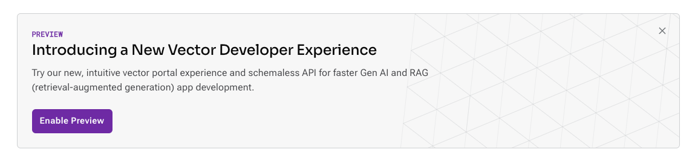
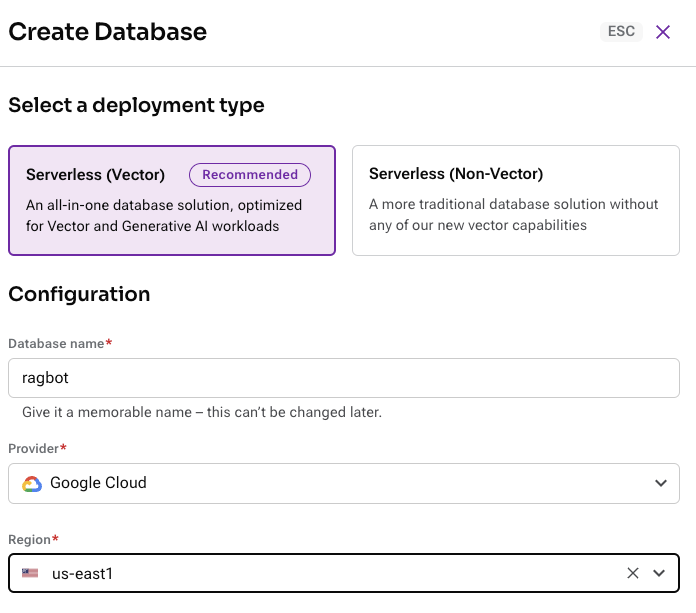
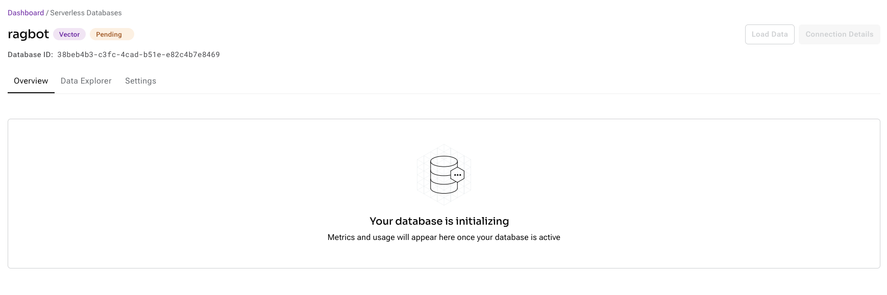
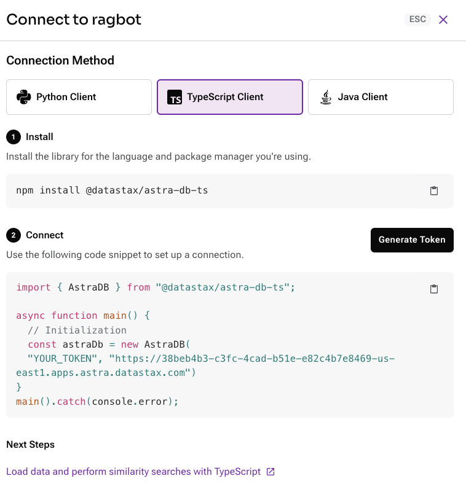
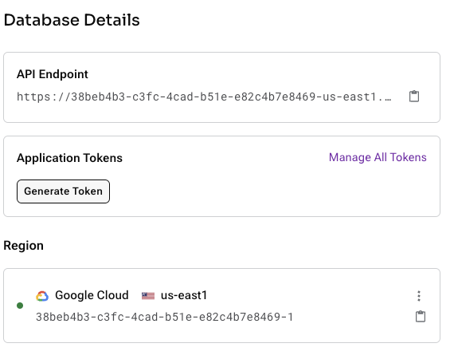

# **Gen AI powered Hiring Assistant with DataStax Astra and Amazon Bedrock** 

Build a streamlined Streamlit application to effectively screen Résumés based on job descriptions. This guide walks you through the process of setting up and running the application.


## **Features** 

- **Streamlit**: For a smooth web application interface.
- **Langchain**: Integrated for advanced functionalities.
- **AWS Services**: Harness the power of Amazon's cloud services.
    - **Amazon Bedrock**: A fully managed service that offers a choice of foundation models (FMs) from leading AI companies like AI21 Labs, Anthropic, Cohere, Meta, Stability AI, and Amazon with a single API, along with a broad set of capabilities you need to build generative AI applications, simplifying development while maintaining privacy and security
- **DataStax Services**: A Unified Data platform for your production ready Gen AI apps
    - **DataStax Astra**: Utilized as a vector database for RAG.

## **Getting Started** 

### **1. Pre-requisites** 

- Clone the repository to your local machine.

### Sign up for Astra DB

Make sure you have a vector-capable Astra database (get one for free at [astra.datastax.com](https://astra.datastax.com/register))

- Once you create an Astra account, enable the new developer preview experience as below.




- Create a Astra Vector database as below





- Wait for the DB to initialized and be ready





- Explore connectivity options using Java, Python and Typescript





- You will be asked to provide the **API Endpoint** which can be found in the right pane underneath *Database details*.
- Ensure you have an **Application Token** for your database which can be created in the right pane underneath *Database details*.




### **2. Setting Up a Environment variables** 

    - `ASTRA_DB_API_ENDPOINT`: Your Astra DB api endpoint
    - `ASTRA_DB_APPLICATION_TOKEN`: The generated app token for your Astra database

### **3. Installing Dependencies**

Install the necessary packages:

```bash
pip install -r requirements.txt
```


### **4. Usage**

To launch the application:

1. Ensure that you have set up your AWS credentials. Refer [here](https://boto3.amazonaws.com/v1/documentation/api/1.20.41/guide/quickstart.html#configuration).


3. Launch the application using Streamlit:
   ```bash
   streamlit run app.py
   ```

4. Your default web browser will open, showcasing the application interface.

5. Follow the on-screen instructions to load your CSV data ([sample data](https://d1nd1o4zkls5mq.cloudfront.net/sample_resumes.zip)) and the desired job description ([sample job description](https://d1nd1o4zkls5mq.cloudfront.net/sample_job_description.txt)).